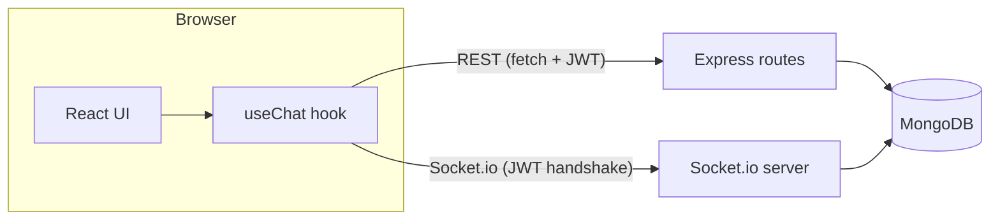
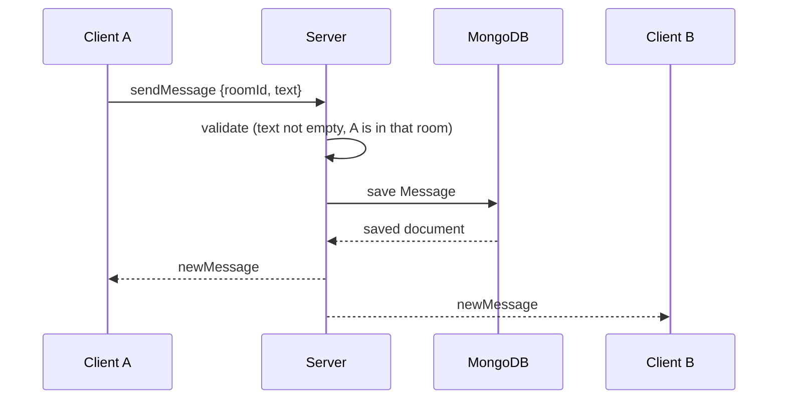

# Chatterbox: Technical Documentation

A real-time chat application built with the MERN stack (MongoDB, Express, React, Node.js) and Socket.io.

---

## 1. Overview

Chatterbox lets users register, log in, join topic-based chat rooms, and exchange messages instantly. Each room shows who is online and who is currently typing. Messages are stored in MongoDB, so the history is available when a user joins or returns to a room.

**Purpose:** demonstrate a full-stack real-time application with authentication, a REST API, WebSocket communication, and persistent storage.

### 1.1 Features

| Area | Feature |
|---|---|
| Accounts | Register and log in with username and password; sessions last 7 days |
| Rooms | Three default rooms (general, study, gaming); users can create new rooms |
| Messaging | Instant delivery to everyone in the room; last 100 messages loaded on join |
| Presence | Live list of users online in the current room |
| Typing | "X is typing…" indicator shown to other users |
| Interface | Responsive layout that works on desktop and mobile |

### 1.2 Technology stack

| Layer | Technology | Role |
|---|---|---|
| Database | MongoDB (Atlas or local) with Mongoose | Stores users, rooms, messages |
| Server | Node.js 18+, Express 4 | REST API |
| Real-time | Socket.io 4 | WebSocket events with fallback |
| Auth | JSON Web Tokens (jsonwebtoken), bcryptjs | Stateless sessions, password hashing |
| Client | React 18, Vite 5 | User interface |
| Client comms | socket.io-client, fetch | Live events and REST calls |

---

## 2. Architecture



The system has two communication channels that share one server process:

1. **REST API** for actions that are request/response by nature: registering, logging in, listing rooms, creating a room, and loading message history.
2. **Socket.io** for live events: joining a room, sending messages, typing, and presence.

Both channels authenticate with the same JWT. The server itself keeps no session state except an in-memory presence map (see section 7.3).

### 2.1 Sending a message



The sender receives the message through the same `newMessage` event as everyone else, so the UI never shows a message that failed to save.

---

## 3. Project structure

```
chatterbox/
├── README.md
├── docs/DOCUMENTATION.md
├── server/
│   ├── server.js                 Entry point: HTTP server, sockets, DB connect
│   ├── package.json
│   ├── .env.example
│   └── src/
│       ├── app.js                Express app, CORS, route mounting
│       ├── config/
│       │   ├── env.js            Reads environment variables
│       │   └── db.js             Connects to MongoDB, seeds default rooms
│       ├── models/               User.js, Room.js, Message.js
│       ├── middleware/auth.js    JWT guard for REST routes
│       ├── controllers/          authController.js, roomController.js
│       ├── routes/               authRoutes.js, roomRoutes.js
│       ├── sockets/
│       │   ├── index.js          Socket.io setup and handshake auth
│       │   └── chatHandlers.js   Event handlers and presence tracking
│       └── utils/                token.js, asyncHandler.js
└── client/
    ├── index.html, vite.config.js, package.json, .env.example
    └── src/
        ├── main.jsx              React entry
        ├── App.jsx               Chooses login screen or chat
        ├── index.css             All styling
        ├── api/client.js         fetch wrapper and API base URL
        ├── hooks/
        │   ├── useSession.js     Login state saved in localStorage
        │   └── useChat.js        Socket connection and all chat state
        └── components/           AuthForm, ChatView, Sidebar,
                                  MessageList, UserList, Composer
```

**Layering on the server:** routes map URLs to controllers, controllers hold the logic and use models, and models talk to MongoDB. Middleware and utilities are shared helpers. Sockets have their own folder because they follow events instead of URLs.

---

## 4. Installation and setup

### 4.1 Prerequisites
- Node.js 18 or newer and npm
- A MongoDB database: either local MongoDB or a free MongoDB Atlas cluster

### 4.2 MongoDB Atlas (summary)
1. Create an account at cloud.mongodb.com and build a free (M0) cluster.
2. Create a database user and save its password.
3. In Network Access, add your IP (or 0.0.0.0/0 for development and cloud hosting).
4. Click Connect, choose Drivers, then copy the `mongodb+srv://` string. Replace `<password>` and add the database name: `...mongodb.net/chatterbox?...`

### 4.3 Configure and run

```bash
# Terminal 1: server
cd server
cp .env.example .env        # then edit MONGO_URI and JWT_SECRET
npm install
npm run dev                 # http://localhost:5000

# Terminal 2: client
cd client
cp .env.example .env
npm install
npm run dev                 # http://localhost:5173
```

The server prints `API + sockets on :5000` when it has connected to MongoDB. On the first run it creates the default rooms.

### 4.4 Environment variables

| File | Variable | Default | Description |
|---|---|---|---|
| server/.env | `MONGO_URI` | none (required) | MongoDB connection string |
| server/.env | `JWT_SECRET` | `dev_secret` | Secret used to sign tokens. **Change it in production.** |
| server/.env | `CLIENT_URL` | `http://localhost:5173` | Allowed origin for CORS and Socket.io |
| server/.env | `PORT` | `5000` | Server port |
| client/.env | `VITE_API_URL` | `http://localhost:5000` | Base URL of the server |

---

## 5. Data models

### 5.1 User
| Field | Type | Rules |
|---|---|---|
| `username` | String | required, unique, trimmed, 3 to 20 characters |
| `passwordHash` | String | required; bcrypt hash (10 salt rounds), never the plain password |

### 5.2 Room
| Field | Type | Rules |
|---|---|---|
| `name` | String | required, unique, trimmed, lowercase, max 24 characters |
| `createdBy` | String | username of the creator, or `system` for default rooms |

### 5.3 Message
| Field | Type | Rules |
|---|---|---|
| `room` | ObjectId (ref Room) | indexed for fast history queries |
| `sender` | String | username of the author |
| `text` | String | max 1000 characters |
| `createdAt` | Date | added automatically (no `updatedAt`) |

Messages store the sender's username directly, which keeps history reads simple (no joins).

---

## 6. REST API reference

Base path: `/api`. All bodies are JSON. Routes under `/api/rooms` require the header:

```
Authorization: Bearer <token>
```

Errors always return `{ "error": "message" }`.

### 6.1 Authentication

**POST /api/register**
- Body: `{ "username": "sam", "password": "secret1" }`
- Success `200`: `{ "token": "<jwt>", "username": "sam" }`
- `400`: missing fields, password under 6 characters, or a model rule is broken (for example a username shorter than 3)
- `409`: username already taken

**POST /api/login**
- Body: `{ "username": "sam", "password": "secret1" }`
- Success `200`: `{ "token": "<jwt>", "username": "sam" }`
- `401`: wrong username or password (the same message is used for both, so attackers cannot tell which was wrong)

### 6.2 Rooms

**GET /api/rooms**
- Returns all rooms sorted by name: `[{ "_id": "...", "name": "general", "createdBy": "system" }]`

**POST /api/rooms**
- Body: `{ "name": "Movie Night" }`
- The name is trimmed, lowercased, and spaces become hyphens (`movie-night`)
- Success `200`: the new room object
- `400`: empty name or name over 24 characters
- `409`: room already exists

**GET /api/rooms/:id/messages**
- Returns up to the last 100 messages of the room, oldest first
- `400`: invalid room id

### 6.3 Status codes summary

| Code | Meaning in this app |
|---|---|
| 200 | Request succeeded |
| 400 | Invalid input or a validation rule failed |
| 401 | Missing, invalid, or expired token; or wrong login credentials |
| 409 | Duplicate username or room name |

---

## 7. Real-time layer (Socket.io)

### 7.1 Connection and authentication

The client connects with its token in the handshake:

```js
io(API_URL, { auth: { token } })
```

The server verifies the token before allowing the connection. An invalid token produces a `connect_error`, and the client responds by logging the user out. The user's identity for every later event comes from the verified token, never from data sent by the client, so users cannot impersonate each other.

### 7.2 Events

**Client to server**

| Event | Payload | Behavior |
|---|---|---|
| `joinRoom` | `roomId` | Leaves any previous room, joins the new one, and updates presence |
| `leaveRoom` | none | Leaves the current room |
| `sendMessage` | `{ roomId, text }` | Ignored if text is empty or the user is not in that room; otherwise saved and broadcast |
| `typing` | `roomId` | Tells others in the room this user is typing |
| `stopTyping` | `roomId` | Tells others this user stopped |

**Server to client**

| Event | Payload | Meaning |
|---|---|---|
| `newMessage` | message document | A message was saved in the current room |
| `roomUsers` | array of usernames | Current unique users in the room |
| `typing` | username | That user is typing |
| `stopTyping` | username | That user stopped typing |

### 7.3 Presence

The server keeps an in-memory map of `roomId → { socketId: username }`. When a user joins, leaves, switches rooms, or disconnects, the server recalculates the unique usernames and sends `roomUsers` to the room. A user with two tabs open appears once.

Because this map lives in memory, it resets if the server restarts and only works with a single server instance.

### 7.4 Typing indicator

The client emits `typing` on each keystroke and `stopTyping` after 1.5 seconds without typing or when the message is sent. The UI hides the current user's own name and grammatically switches between "is" and "are".

---

## 8. Authentication and security

**Flow**
1. The user registers or logs in and receives a JWT valid for 7 days. The payload contains the user id and username.
2. The client stores `{ token, username }` in `localStorage` under the key `session`.
3. REST calls send the token in the `Authorization` header; the `requireAuth` middleware verifies it and attaches `req.user`.
4. The socket handshake verifies the same token.
5. Logging out deletes the stored session and disconnects the socket.

**Implemented protections**
- Passwords are hashed with bcrypt and never returned by the API
- Login errors do not reveal whether the username exists
- Identity for socket events is taken from the token
- CORS restricted to `CLIENT_URL`
- Length limits on usernames, room names, and messages
- The React UI escapes message text by default, which prevents script injection through chat messages

**Known limitations** (see section 12 for improvements)
- The token is kept in `localStorage`, which is readable by any script running on the page
- No rate limiting on login or messaging
- Any logged-in user can join any room (no private rooms)
- Token expiry is only checked when a connection is made or a REST call is sent

---

## 9. Frontend architecture

### 9.1 State and data flow

`App` reads the session through `useSession`. Without a session it renders `AuthForm`; with one it renders `ChatView`. `ChatView` calls the `useChat` hook once and passes data and callbacks down to presentational components.

### 9.2 Hooks

**useSession()** returns `[session, setSession]` and keeps the session in `localStorage`. Passing `null` logs out.

**useChat(token, onLogout)** owns the socket connection and everything that depends on it:
- Opens the socket on mount, closes it on unmount
- Loads rooms and selects the first one
- On room change: clears typing state, loads history over REST, then emits `joinRoom`
- Subscribes to `newMessage`, `roomUsers`, `typing`, and `stopTyping`
- Returns `rooms, room, setRoom, msgs, users, typing, send, notifyTyping, addRoom`

### 9.3 Components

| Component | Responsibility |
|---|---|
| `AuthForm` | Login/register form with error messages and mode toggle |
| `ChatView` | Layout; connects `useChat` to the other components |
| `Sidebar` | Room list, create-room form, current user and logout |
| `MessageList` | Renders messages, styles own messages differently, auto-scrolls |
| `UserList` | Online users in the current room |
| `Composer` | Text input and send button; reports typing activity |

### 9.4 Responsive design

Below 720 px the sidebar becomes a horizontal room bar, and the create-room form and online list are hidden to save space.

---

## 10. Deployment

**Database:** MongoDB Atlas. Allow `0.0.0.0/0` in Network Access, since cloud hosts have changing IP addresses.

**Server:** Render, Railway, or a similar host that supports long-running WebSocket servers. Vercel serverless functions do not fit Socket.io.
- Root directory: `server`
- Build command: `npm install`
- Start command: `npm start`
- Environment: `MONGO_URI`, `JWT_SECRET` (a long random value), `CLIENT_URL` (the exact frontend URL, no trailing slash)

**Client:** Vercel or Netlify.
- Root directory: `client`
- Build command: `npm run build`
- Output directory: `dist`
- Environment: `VITE_API_URL` (the deployed server URL)

**Order:** deploy the server first, copy its URL into the client's `VITE_API_URL`, deploy the client, then set the server's `CLIENT_URL` to the client URL.

Free hosting plans may pause an idle server, so the first request after a break can be slow. Open the app a few minutes before a demo.

---

## 11. Troubleshooting

| Symptom | Likely cause | Fix |
|---|---|---|
| `querySrv EBADRESP` on start | Network or ISP blocks SRV DNS lookups | Already handled in `config/db.js` (uses Google and Cloudflare DNS). Otherwise use the non-SRV Atlas string or another network |
| `Mongo connection failed` (auth error) | Wrong password, or special characters not URL-encoded | Re-check the password, use an autogenerated one |
| Connection times out | IP not in Atlas Network Access | Add your IP or `0.0.0.0/0` |
| Browser shows CORS error | `CLIENT_URL` differs from the frontend origin | Match it exactly, including `http`/`https` and port |
| Logged out immediately after login | Socket handshake rejected (bad token or different `JWT_SECRET`) | Clear `localStorage`, log in again, check `JWT_SECRET` |
| Messages do not appear in real time | Client points at the wrong `VITE_API_URL` | Fix the variable and restart `npm run dev` |
| Stops working after a network drop | Socket reconnects but does not rejoin the room | Refresh the page or switch rooms (see limitations) |

---

## 12. Limitations and future improvements

**Current limitations**
- After an automatic socket reconnect, the user is not re-added to the room until they switch rooms or refresh
- Presence is stored in server memory (single instance only)
- History shows the latest 100 messages with no "load older" option
- No automated tests

**Improvement ideas**
1. Rejoin the current room on socket `connect`
2. Private rooms with invite links and membership checks
3. Direct messages and unread badges
4. Image sharing with cloud storage
5. Rate limiting (`express-rate-limit`) and `helmet` for security headers
6. Store the token in an httpOnly cookie
7. Redis adapter for Socket.io to support several server instances
8. Automated tests: Jest and Supertest for the API, React Testing Library for components

---

## 13. Manual test checklist

1. Register a new account; confirm you land in the chat.
2. Register a second account in another browser or private window.
3. Send a message in `#general` from account A; confirm B sees it instantly.
4. Type in A without sending; confirm B sees "is typing…", and it disappears after a pause.
5. Confirm the online list shows both users; close B and confirm A's list updates.
6. Create a new room in A; switch to it and send a message; refresh and confirm the history loads.
7. Log out and log in again; confirm the session and rooms work.
8. Try registering a duplicate username; confirm the error message appears.
9. Try logging in with a wrong password; confirm the error message appears.
